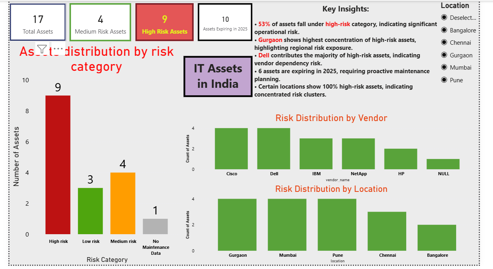

# IT-Asset-Risk-Analysis
Interactive Power BI dashboard analysing IT asset lifecycle data to uncover risk patterns, maintenance gaps, and vendor/location-based risk concentration.
Power BI dashboard analysing IT asset lifecycle data to identify risk patterns, vendor dependency, and maintenance gaps.
# IT Asset Risk Analysis Dashboard

## SQL Analysis
Basic SQL queries were used to analyse asset distribution, risk categories, and maintenance expiry trends before building the Power BI dashboard.

The dashboard is built using Power BI and focuses on converting raw asset data into actionable insights for better decision-making.

---

## Tools & Technologies
- SQL (data preparation)
- Power BI (data visualization & dashboard)
- Excel (dataset creation)

---

## Key Business Questions
- How many assets fall under high, medium, and low risk?
- Which vendors contribute most to high-risk assets?
- Which locations have the highest concentration of risk?
- How many assets are approaching maintenance expiry?
- Are there regions with concentrated operational risk?

---

## Key Insights
- 53% of assets fall under the high-risk category, indicating significant operational risk.
- Gurgaon shows the highest concentration of high-risk assets, highlighting regional risk exposure.
- Dell contributes the majority of high-risk assets, indicating vendor dependency risk.
- Multiple assets are expiring in 2025, requiring proactive maintenance planning.
- Certain locations show 100% high-risk assets when filtered, indicating concentrated risk clusters.

---

## Dashboard Features
- Interactive dashboard with location-based filtering
- Risk distribution analysis by category, vendor, and location
- Maintenance expiry tracking
- Summary KPIs using cards for quick overview

---

## Files Included
- `IT_Asset_Risk_Dashboard.pbix` – Power BI dashboard file
- `dashboard.png` – Dashboard preview image

---

## Project Outcome
This project demonstrates how asset lifecycle data can be analysed to identify risk exposure, vendor dependency, and maintenance gaps, enabling proactive infrastructure management.

---

## Future Improvements
- Integration with real-time asset data sources
- Predictive analysis for risk forecasting
- Cost vs risk optimisation analysis
